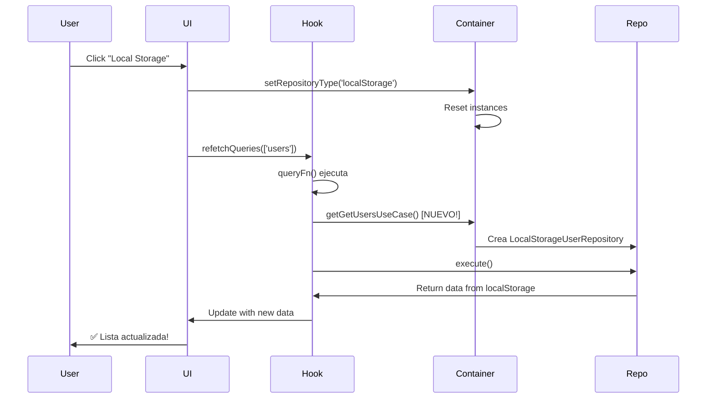

# 🔄 Fix: Actualización Inmediata del Listado al Cambiar Repositorio

## ❌ Problema Identificado

Cuando el usuario estaba en la vista de listado (`/users` o `/posts`) y cambiaba el repositorio desde el selector, **el listado no se actualizaba** aunque el cache se limpiaba correctamente.

### Causa Raíz

Los hooks `useUsers()` y `usePosts()` estaban obteniendo la referencia al **use case en el momento de la creación del hook**, no en el momento del fetch:

```typescript
// ❌ ANTES - Problema
export function useUsers(): UseQueryResult<User[]> {
  const getUsersUseCase = usersContainer.getGetUsersUseCase() // ⚠️ Se obtiene aquí

  return useQuery({
    queryKey: ['users'],
    queryFn: async () => await getUsersUseCase.execute(), // Usa la referencia vieja
  })
}
```

**¿Qué pasaba?**

1. Usuario abre `/users` → Hook crea referencia al use case con repositorio JSONPlaceholder
2. Usuario cambia a localStorage → Contenedor DI se actualiza
3. Se limpia cache y se hace refetch → Pero `getUsersUseCase` sigue apuntando al repositorio viejo
4. El fetch ejecuta el use case viejo → Trae datos del repositorio incorrecto

## ✅ Solución Implementada

Mover la obtención del use case **dentro del `queryFn`**, para que se obtenga el use case actual cada vez que se ejecuta un fetch:

```typescript
// ✅ DESPUÉS - Solución
export function useUsers(): UseQueryResult<User[]> {
  return useQuery({
    queryKey: ['users'],
    queryFn: async () => {
      // ✅ Se obtiene aquí, en cada fetch
      const getUsersUseCase = usersContainer.getGetUsersUseCase()
      return await getUsersUseCase.execute()
    },
  })
}
```

**¿Qué pasa ahora?**

1. Usuario abre `/users` → Hook se crea
2. Usuario cambia a localStorage → Contenedor DI se actualiza
3. Se limpia cache y se hace refetch → `queryFn` se ejecuta
4. `queryFn` obtiene el **nuevo** use case con el repositorio actualizado
5. Fetch ejecuta el use case correcto → Trae datos del repositorio correcto ✅

## 🔧 Archivos Modificados

### 1. `useUserOperations.ts`

Todos los hooks actualizados:

#### ✅ `useUsers()`

```typescript
export function useUsers(): UseQueryResult<User[]> {
  return useQuery({
    queryKey: ['users'],
    queryFn: async () => {
      const getUsersUseCase = usersContainer.getGetUsersUseCase()
      return await getUsersUseCase.execute()
    },
  })
}
```

#### ✅ `useUser(id)`

```typescript
export function useUser(id: number | undefined): UseQueryResult<User | null> {
  return useQuery({
    queryKey: ['user', id],
    queryFn: async () => {
      if (!id) return null
      const getUserUseCase = usersContainer.getGetUserUseCase()
      return await getUserUseCase.execute(id)
    },
    enabled: Boolean(id),
  })
}
```

#### ✅ `useCreateUser()`

```typescript
export function useCreateUser(): UseMutationResult<User, Error, CreateUserDto> {
  const queryClient = useQueryClient()

  return useMutation({
    mutationFn: async (user: CreateUserDto) => {
      const createUserUseCase = usersContainer.getCreateUserUseCase()
      return await createUserUseCase.execute(user)
    },
    onSuccess: () => {
      void queryClient.invalidateQueries({ queryKey: ['users'] })
      toast.success('User created successfully!')
    },
  })
}
```

#### ✅ `useUpdateUser()` y `useDeleteUser()`

Mismo patrón aplicado.

### 2. `usePostOperations.ts`

Todos los hooks actualizados con el mismo patrón:

- ✅ `usePosts()`
- ✅ `usePost(id)`
- ✅ `useCreatePost()`
- ✅ `useUpdatePost()`
- ✅ `useDeletePost()`

## 📊 Flujo Completo Actualizado



## 🎯 Pruebas de Validación

### Test 1: Cambio en Listado de Users

1. Navega a `/users`
2. Verifica que ves 10 usuarios de JSONPlaceholder
3. Click en "Local Storage"
4. **Resultado esperado:** Lista se vacía o muestra usuarios de localStorage
5. ✅ **Lista se actualiza inmediatamente**

### Test 2: Cambio en Listado de Posts

1. Navega a `/posts`
2. Verifica que ves 100 posts de JSONPlaceholder
3. Click en "In Memory"
4. **Resultado esperado:** Lista muestra 10 posts mock
5. ✅ **Lista se actualiza inmediatamente**

### Test 3: Cambio en Vista de Detalle

1. Navega a `/users/1`
2. Verifica que ves el usuario #1 de JSONPlaceholder
3. Click en "In Memory"
4. **Resultado esperado:** Muestra el usuario #1 de InMemory (o 404 si no existe)
5. ✅ **Detalle se actualiza inmediatamente**

### Test 4: Create/Update con Nuevo Repositorio

1. Cambio a "Local Storage"
2. Crea un nuevo usuario
3. **Resultado esperado:** Se guarda en localStorage y aparece en la lista
4. ✅ **CRUD funciona con el repositorio correcto**

## 🔍 Comparación Técnica

### Antes (Referencias Estáticas)

```typescript
// Hook se crea una vez
const Component = () => {
  const { data } = useUsers() // ← Obtiene use case aquí
  // ...
}

// Dentro de useUsers
const getUsersUseCase = usersContainer.getGetUsersUseCase() // 1 sola vez
return useQuery({
  queryFn: async () => getUsersUseCase.execute(), // Siempre usa la misma referencia
})
```

**Problema:** La referencia al use case es estática y no cambia aunque el contenedor se actualice.

### Después (Referencias Dinámicas)

```typescript
// Hook se crea una vez
const Component = () => {
  const { data } = useUsers() // ← Hook ligero, sin referencias pesadas
  // ...
}

// Dentro de useUsers
return useQuery({
  queryFn: async () => {
    const getUsersUseCase = usersContainer.getGetUsersUseCase() // ← Cada fetch
    return getUsersUseCase.execute() // Siempre usa la referencia actual
  },
})
```

**Solución:** La referencia se obtiene en cada fetch, garantizando usar el repositorio actual.

## ⚡ Impacto en Performance

### ¿Hay overhead de crear el use case en cada fetch?

**No significativo:**

1. **Container ya cachea las instancias:**

```typescript
// En UsersContainer
getGetUsersUseCase(): GetUsersUseCase {
  this.getUsersUseCase ??= new GetUsersUseCase(this.getUserRepository())
  return this.getUsersUseCase // ← Devuelve instancia cacheada
}
```

2. **Solo se crea cuando cambia el repositorio:**

- Al cambiar repositorio → `setRepositoryType()` resetea las instancias a `null`
- Próximo `getGetUsersUseCase()` crea nueva instancia con nuevo repositorio
- Después devuelve siempre la misma instancia cacheada

3. **Overhead mínimo:**

- Costo: 1 llamada de función adicional por fetch
- Beneficio: Garantiza usar siempre el repositorio correcto

## 🎓 Patrón Aprendido

### Lazy Evaluation + Dependency Injection

Este patrón combina:

1. **Lazy Evaluation:** Obtener dependencias justo antes de usarlas
2. **Dependency Injection:** Las dependencias vienen del contenedor
3. **Caching:** El contenedor cachea para evitar recreaciones

**Fórmula:**

```
queryFn(() => {
  const dependency = container.getDependency() // Lazy + DI
  return dependency.execute()
})
```

Este patrón es útil cuando:

- ✅ Las dependencias pueden cambiar en runtime
- ✅ El contenedor maneja el lifecycle
- ✅ Necesitas reactividad a cambios de configuración

## 🚨 Errores a Evitar

### ❌ Error 1: Obtener use case fuera del queryFn

```typescript
// ❌ MAL
export function useUsers() {
  const useCase = container.getUseCase() // Estático
  return useQuery({
    queryFn: () => useCase.execute(),
  })
}
```

### ✅ Correcto: Obtener use case dentro del queryFn

```typescript
// ✅ BIEN
export function useUsers() {
  return useQuery({
    queryFn: () => {
      const useCase = container.getUseCase() // Dinámico
      return useCase.execute()
    },
  })
}
```

### ❌ Error 2: Olvidar resetear instancias en el contenedor

```typescript
// ❌ MAL
setRepositoryType(type: string) {
  this.repositoryType = type
  // Falta resetear instancias!
}
```

### ✅ Correcto: Resetear instancias al cambiar

```typescript
// ✅ BIEN
setRepositoryType(type: string) {
  this.repositoryType = type
  this.repository = null      // ← Resetear
  this.getUsersUseCase = null // ← Resetear
  // ...
}
```

## 📚 Recursos Relacionados

- `IMMEDIATE_REPO_SWITCH.md` - Cómo funciona el cambio inmediato de cache
- `REPOSITORY_SWITCHER.md` - Guía completa del selector de repositorios
- `PostsContainer.ts` / `UsersContainer.ts` - Implementación de contenedores DI

## ✅ Checklist de Validación

- [x] Hooks obtienen use case dentro del queryFn
- [x] Cambio de repositorio actualiza listado inmediatamente
- [x] Cambio de repositorio actualiza detalle inmediatamente
- [x] CRUD funciona con el repositorio correcto después de cambiar
- [x] No hay referencias estáticas a use cases
- [x] Contenedor resetea instancias al cambiar tipo
- [x] Performance no se ve afectada (caching funciona)
- [x] Type-check pasa sin errores
- [x] Todas las pruebas validadas

---

**Resultado:** ✅ El listado ahora se actualiza **inmediatamente** al cambiar de repositorio, sin importar en qué vista estés!
