# 🚀 Cambio Inmediato de Repositorio - Solución Implementada

## ❌ Problema Original

Al cambiar de repositorio desde la UI, los datos **no se actualizaban inmediatamente**. El usuario tenía que:

- Navegar a otra página
- Recargar manualmente
- Esperar a que el cache expire

Esto ocurría porque `invalidateQueries()` solo marca las queries como "stale" pero no las refetch inmediatamente.

## ✅ Solución Implementada

### Cambios en `RepositorySelector.tsx`

#### Antes (No funcionaba inmediatamente):

```typescript
const handleUserRepoChange = (type: UserRepositoryType): void => {
  usersContainer.setRepositoryType(type)
  setUserRepoType(type)
  void queryClient.invalidateQueries({ queryKey: ['users'] })
  toast.success('User repository changed')
}
```

#### Después (Cambio inmediato):

```typescript
const handleUserRepoChange = async (
  type: UserRepositoryType
): Promise<void> => {
  usersContainer.setRepositoryType(type)
  setUserRepoType(type)

  // 1. Cancelar queries en progreso
  await queryClient.cancelQueries({ queryKey: ['users'] })

  // 2. Limpiar cache completamente
  queryClient.removeQueries({ queryKey: ['users'] })

  // 3. Forzar refetch inmediato con el nuevo repositorio
  await queryClient.refetchQueries({ queryKey: ['users'] })

  toast.success('User repository changed')
}
```

### ¿Por qué funciona ahora?

#### 1. **`cancelQueries()`** - Cancela requests en progreso

```typescript
await queryClient.cancelQueries({ queryKey: ['users'] })
```

- Cancela cualquier fetch que esté en proceso
- Evita race conditions
- Asegura que no se mezclen datos de repositorios diferentes

#### 2. **`removeQueries()`** - Limpia el cache

```typescript
queryClient.removeQueries({ queryKey: ['users'] })
```

- Elimina todos los datos cacheados
- Fuerza a TanStack Query a considerar los datos como "no existentes"
- Garantiza que el próximo fetch use el nuevo repositorio

#### 3. **`refetchQueries()`** - Refetch inmediato

```typescript
await queryClient.refetchQueries({ queryKey: ['users'] })
```

- Ejecuta inmediatamente un nuevo fetch
- Usa el nuevo repositorio configurado
- Actualiza la UI automáticamente

### Flujo Completo

```mermaid
sequenceDiagram
    participant User
    participant UI
    participant Container
    participant QueryClient
    participant OldRepo
    participant NewRepo

    User->>UI: Click en "Local Storage"
    UI->>Container: setRepositoryType('localStorage')
    Container->>Container: Reset instances
    UI->>QueryClient: cancelQueries(['users'])
    QueryClient->>OldRepo: ❌ Cancel ongoing requests
    UI->>QueryClient: removeQueries(['users'])
    QueryClient->>QueryClient: 🗑️ Clear cache
    UI->>QueryClient: refetchQueries(['users'])
    QueryClient->>NewRepo: ✅ Fetch from new repository
    NewRepo->>QueryClient: Return data
    QueryClient->>UI: Update with new data
    UI->>User: 🎉 UI updated instantly!
```



## 🎯 Comportamiento Actual

### Cambio de JSONPlaceholder a LocalStorage

1. **Click en botón** "Local Storage"
2. **Inmediatamente:**
   - Se muestran los datos de localStorage (o lista vacía si está vacío)
   - El loading state se muestra brevemente
   - No hay datos mezclados de la API anterior

### Cambio de LocalStorage a InMemory

1. **Click en botón** "In Memory"
2. **Inmediatamente:**
   - Se muestran los 5 usuarios de prueba (o 10 posts)
   - Los datos de localStorage desaparecen
   - Latencia simulada (200-400ms) se muestra con loading state

### Cambio de InMemory a JSONPlaceholder

1. **Click en botón** "JSONPlaceholder API"
2. **Inmediatamente:**
   - Se inicia el fetch a la API externa
   - Loading state mientras carga
   - Datos de la API se muestran cuando llegan

## 🔬 Comparación: invalidateQueries vs refetchQueries

### `invalidateQueries()` ❌ (No inmediato)

```typescript
void queryClient.invalidateQueries({ queryKey: ['users'] })
```

**Comportamiento:**

- Marca las queries como "stale"
- **No refetch automáticamente** si no están montadas
- Espera a que el componente se vuelva a montar
- Puede mantener datos viejos en pantalla

**Cuándo usar:**

- Background updates
- No necesitas cambio inmediato
- Quieres que refetch cuando el usuario vuelva a la página

### `refetchQueries()` ✅ (Inmediato)

```typescript
await queryClient.refetchQueries({ queryKey: ['users'] })
```

**Comportamiento:**

- **Refetch inmediatamente** todas las queries que coincidan
- Actualiza la UI automáticamente
- Muestra loading states
- Garantiza datos frescos

**Cuándo usar:**

- Cambios de configuración (como cambiar repositorio)
- Después de mutaciones importantes
- Cuando necesitas actualización inmediata
- User-triggered refreshes

### `removeQueries()` 🗑️ (Limpieza total)

```typescript
queryClient.removeQueries({ queryKey: ['users'] })
```

**Comportamiento:**

- Elimina completamente los datos del cache
- Fuerza a las queries a estar en estado "initial"
- Siguiente fetch será como si fuera la primera vez

**Cuándo usar:**

- Cambio de fuente de datos
- Logout de usuario
- Cambio de contexto completo
- Quieres asegurar datos completamente frescos

## 📊 Impacto en Performance

### Antes (invalidateQueries)

```
User clicks → State updates → UI waits → User navigates → Then refetch
Tiempo: Variable (depende de navegación del usuario)
```

### Después (cancelQueries + removeQueries + refetchQueries)

```
User clicks → Cancel ongoing → Clear cache → Refetch → UI updates
Tiempo: ~300-500ms (depende del repositorio)
```

### Trade-offs

**✅ Ventajas:**

- Cambio inmediato visible
- UX mejorada
- Feedback claro al usuario
- No hay datos mezclados

**⚠️ Consideraciones:**

- Ligeramente más trabajo para el navegador
- Puede causar un flash de loading state
- Si el repositorio es lento, se nota

## 🎨 Mejoras Futuras (Opcional)

### 1. Optimistic UI Update

Mostrar datos nuevos inmediatamente mientras se carga:

```typescript
const handleUserRepoChange = async (
  type: UserRepositoryType
): Promise<void> => {
  // Mostrar datos mock mientras carga
  if (type === 'inMemory') {
    const mockData = [
      /* ... */
    ]
    queryClient.setQueryData(['users'], mockData)
  }

  usersContainer.setRepositoryType(type)
  // ... resto del código
}
```

### 2. Confirmación antes de cambiar

Si hay cambios sin guardar:

```typescript
const handleUserRepoChange = async (
  type: UserRepositoryType
): Promise<void> => {
  const hasPendingChanges = checkPendingChanges()

  if (hasPendingChanges) {
    const confirmed = await confirm('You have unsaved changes. Continue?')
    if (!confirmed) return
  }

  // ... cambiar repositorio
}
```

### 3. Persistir selección

Guardar la selección en localStorage:

```typescript
const handleUserRepoChange = async (
  type: UserRepositoryType
): Promise<void> => {
  // ... cambiar repositorio

  // Persistir selección
  localStorage.setItem('preferred_user_repo', type)
}

// Al iniciar la app
useEffect(() => {
  const savedRepo = localStorage.getItem('preferred_user_repo')
  if (savedRepo) {
    void handleUserRepoChange(savedRepo as UserRepositoryType)
  }
}, [])
```

### 4. Animación de transición

```typescript
const [isChanging, setIsChanging] = useState(false)

const handleUserRepoChange = async (type: UserRepositoryType): Promise<void> => {
  setIsChanging(true)

  await queryClient.cancelQueries({ queryKey: ['users'] })
  queryClient.removeQueries({ queryKey: ['users'] })

  usersContainer.setRepositoryType(type)
  setUserRepoType(type)

  await queryClient.refetchQueries({ queryKey: ['users'] })

  setIsChanging(false)
  toast.success('Repository changed')
}

// En el JSX
{isChanging && <LoadingOverlay />}
```

## 🐛 Troubleshooting

### Los datos no cambian

**Problema:** Después de cambiar repositorio, siguen apareciendo datos viejos.

**Solución:**

1. Verifica que `removeQueries` esté antes de `refetchQueries`
2. Asegúrate de que el queryKey coincida exactamente
3. Verifica en DevTools que el cache se limpia

### Race conditions

**Problema:** A veces aparecen datos mezclados de dos repositorios.

**Solución:**

1. Asegúrate de usar `await` en `cancelQueries`
2. El `removeQueries` debe ejecutarse después
3. Verifica que el contenedor DI se resetea correctamente

### Loading state muy largo

**Problema:** El loading state dura demasiado.

**Solución:**

1. InMemory tiene latencia simulada (ajustable)
2. LocalStorage debe ser instantáneo
3. JSONPlaceholder depende de la red

### No muestra loading state

**Problema:** El cambio parece "congelarse" sin feedback visual.

**Solución:**

```typescript
// Los componentes deben manejar isLoading
const { data, isLoading } = useUsers()

if (isLoading) {
  return <LoadingSpinner />
}
```

## 📚 Recursos

- [TanStack Query - Query Invalidation](https://tanstack.com/query/latest/docs/guides/query-invalidation)
- [TanStack Query - Query Cancellation](https://tanstack.com/query/latest/docs/guides/query-cancellation)
- [TanStack Query - removeQueries](https://tanstack.com/query/latest/docs/reference/QueryClient#queryclientremovequeries)

## ✅ Checklist de Implementación

- [x] Cambiar `invalidateQueries` por `refetchQueries`
- [x] Agregar `cancelQueries` antes del cambio
- [x] Agregar `removeQueries` para limpiar cache
- [x] Usar `async/await` para secuencia correcta
- [x] Agregar `void` en onClick para manejar Promise
- [x] Verificar que funciona en todos los casos
- [x] Loading states visibles durante cambio
- [ ] Opcional: Persistir selección en localStorage
- [ ] Opcional: Animaciones de transición
- [ ] Opcional: Confirmación antes de cambiar

---

**Resultado:** ✅ El cambio de repositorio ahora es **inmediato y visible** en la UI!
