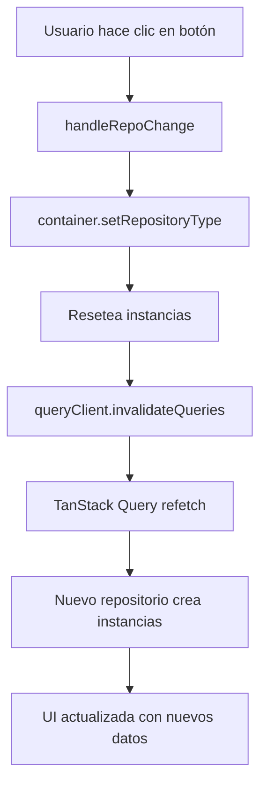

# 🔄 Repository Switcher - Guía Completa

## ✨ Características Implementadas

### 🎯 Selector Interactivo de Repositorios

Se ha implementado un sistema completo de cambio dinámico de fuentes de datos tanto para **Users** como para **Posts**.

## 📦 Nuevos Repositorios Creados

### Para el Módulo de Posts

#### 1. LocalStoragePostRepository

- **Ubicación:** `src/modules/posts/infrastructure/repositories/LocalStoragePostRepository.ts`
- **Almacenamiento:** localStorage del navegador bajo la clave `posts_storage`
- **Persistencia:** Los datos sobreviven a recargas de página
- **Operaciones:** CRUD completo funcional

#### 2. InMemoryPostRepository

- **Ubicación:** `src/modules/posts/infrastructure/repositories/InMemoryPostRepository.ts`
- **Datos de prueba:** 10 posts pre-cargados con contenido técnico sobre React y desarrollo web
- **Latencia simulada:** 200-400ms para simular llamadas de red
- **Persistencia:** Solo durante la sesión actual

### Para el Módulo de Users

Ya existían 3 repositorios:

- JsonPlaceholderUserRepository (API externa)
- LocalStorageUserRepository (localStorage)
- InMemoryUserRepository (5 usuarios mock)

## 🎨 Componente UI - RepositorySelector

### Ubicación

`src/components/shared/RepositorySelector.tsx`

### Características

✅ **Interfaz visual intuitiva** con iconos descriptivos:

- 🌐 **Server**: JSONPlaceholder API (External REST API)
- 💾 **HardDrive**: Local Storage (Browser persistence)
- 🗄️ **Database**: In Memory (Mock data - session)

✅ **Selectores independientes** para Users y Posts

✅ **Feedback visual**:

- Botón activo resaltado
- Botón deshabilitado cuando ya está seleccionado
- Toast notifications al cambiar

✅ **Invalidación automática** del cache de TanStack Query

✅ **Información contextual** sobre el comportamiento de cada repositorio

### Código del Componente

```typescript
// Cambiar repositorio de usuarios
const handleUserRepoChange = (type: UserRepositoryType): void => {
  usersContainer.setRepositoryType(type)
  setUserRepoType(type)
  void queryClient.invalidateQueries({ queryKey: ['users'] })
  toast.success('User repository changed')
}

// Cambiar repositorio de posts
const handlePostRepoChange = (type: PostRepositoryType): void => {
  postsContainer.setRepositoryType(type)
  setPostRepoType(type)
  void queryClient.invalidateQueries({ queryKey: ['posts'] })
  toast.success('Post repository changed')
}
```

## 🎪 Integración en el Layout

### AppLayout Actualizado

El componente `RepositorySelector` se integra en el `AppLayout` con:

1. **Botón en el Header**: Icono de base de datos junto al toggle de tema
2. **Panel Lateral**: Aparece/desaparece al hacer clic en el botón
3. **Layout Responsive**:
   - Desktop: Panel lateral sticky
   - Mobile: Panel sobre el contenido principal

### Estructura Visual

```
┌─────────────────────────────────────────────────┐
│ Header: [Logo] [Nav] [DB Button] [Theme Toggle]│
├─────────────────────────────────────────────────┤
│                                                 │
│  ┌─────────────────┐    ┌──────────────────┐  │
│  │                 │    │ Repository       │  │
│  │  Main Content   │    │ Configuration    │  │
│  │  (Outlet)       │    │                  │  │
│  │                 │    │ Users Repo:      │  │
│  │                 │    │ [x] API          │  │
│  │                 │    │ [ ] localStorage │  │
│  │                 │    │ [ ] InMemory     │  │
│  │                 │    │                  │  │
│  │                 │    │ Posts Repo:      │  │
│  │                 │    │ [x] API          │  │
│  │                 │    │ [ ] localStorage │  │
│  │                 │    │ [ ] InMemory     │  │
│  └─────────────────┘    └──────────────────┘  │
│                                                 │
└─────────────────────────────────────────────────┘
```

## 🚀 Cómo Usar

### 1. Acceder al Selector

1. Ejecuta la aplicación: `pnpm dev`
2. Busca el icono de base de datos (🗄️) en el header
3. Haz clic para abrir el panel de configuración

### 2. Cambiar Repositorios

**Para Users:**

- Haz clic en cualquiera de los 3 botones bajo "Users Repository"
- El botón activo se resaltará
- Verás una notificación confirmando el cambio
- Los datos se recargarán automáticamente

**Para Posts:**

- Haz clic en cualquiera de los 3 botones bajo "Posts Repository"
- Similar al comportamiento de Users

### 3. Probar Diferentes Escenarios

#### Escenario 1: Desarrollo sin Internet

```
Users: localStorage
Posts: inMemory
```

- Los usuarios se guardarán en tu navegador
- Los posts se resetearán al recargar

#### Escenario 2: Testing Rápido

```
Users: inMemory (5 usuarios pre-cargados)
Posts: inMemory (10 posts pre-cargados)
```

- Datos instantáneos para testing
- No requiere red ni persistencia

#### Escenario 3: Demo con Persistencia Local

```
Users: localStorage
Posts: localStorage
```

- Todo se guarda localmente
- Los cambios persisten entre sesiones

#### Escenario 4: Producción/API Real

```
Users: jsonplaceholder
Posts: jsonplaceholder
```

- Datos de API externa
- Simula entorno de producción

## 🔧 Arquitectura Técnica

### Dependency Injection Containers

Ambos módulos (Users y Posts) ahora tienen contenedores DI actualizados:

#### PostsContainer

```typescript
export type PostRepositoryType = 'jsonplaceholder' | 'localStorage' | 'inMemory'

class PostsContainer {
  private repositoryType: PostRepositoryType = 'jsonplaceholder'

  setRepositoryType(type: PostRepositoryType): void {
    if (this.repositoryType !== type) {
      this.repositoryType = type
      // Reset todas las instancias
      this.postRepository = null
      // ... reset otros use cases
    }
  }

  getPostRepository(): IPostRepository {
    switch (this.repositoryType) {
      case 'localStorage':
        return new LocalStoragePostRepository()
      case 'inMemory':
        return new InMemoryPostRepository()
      default:
        return new JsonPlaceholderPostRepository()
    }
  }
}
```

#### UsersContainer

Similar implementación con `UserRepositoryType`.

### Flujo de Datos



## 📊 Comparación de Repositorios

### Posts

| Característica  | JSONPlaceholder | LocalStorage | InMemory    |
| --------------- | --------------- | ------------ | ----------- |
| Posts iniciales | 100 (API)       | 0 (vacío)    | 10 (mock)   |
| Latencia        | Real (red)      | Instantáneo  | 200-400ms   |
| Persistencia    | Externa         | localStorage | Sesión      |
| CRUD            | Simulado        | ✅ Completo  | ✅ Completo |
| Internet        | ✅ Requerido    | ❌ No        | ❌ No       |

### Users

| Característica  | JSONPlaceholder | LocalStorage | InMemory    |
| --------------- | --------------- | ------------ | ----------- |
| Users iniciales | 10 (API)        | 0 (vacío)    | 5 (mock)    |
| Latencia        | Real (red)      | Instantáneo  | 200-400ms   |
| Persistencia    | Externa         | localStorage | Sesión      |
| CRUD            | Simulado        | ✅ Completo  | ✅ Completo |
| Internet        | ✅ Requerido    | ❌ No        | ❌ No       |

## 🎯 Casos de Uso Recomendados

### 1. Desarrollo Activo

```
Recomendación: inMemory
Razón: Datos predefinidos, rápido, se resetea fácilmente
```

### 2. Testing de Persistencia

```
Recomendación: localStorage
Razón: Prueba el comportamiento de guardado/lectura
```

### 3. Testing de API

```
Recomendación: jsonplaceholder
Razón: Simula comportamiento real de red
```

### 4. Demos Offline

```
Recomendación: localStorage o inMemory
Razón: No requiere conexión a internet
```

### 5. Presentaciones

```
Recomendación: inMemory
Razón: Datos limpios y predefinidos, latencia simulada
```

## 🐛 Consideraciones y Limitaciones

### LocalStorage

⚠️ **Límites del navegador:**

- Chrome: ~10MB
- Firefox: ~10MB
- Safari: ~5MB

⚠️ **Datos sincrónicos:**

- Puede bloquear UI con grandes volúmenes

⚠️ **Seguridad:**

- Datos en texto plano
- Accesible por JavaScript
- No usar para datos sensibles

### InMemory

⚠️ **Volatilidad:**

- Se pierde al recargar la página
- No compartido entre tabs

⚠️ **Memoria:**

- Ocupa RAM mientras la app está abierta

### JSONPlaceholder

⚠️ **Rate Limiting:**

- Posibles límites de la API pública

⚠️ **Mutaciones simuladas:**

- POST/PUT/DELETE no persisten realmente
- Solo simulan respuesta exitosa

## 🔐 Persistencia de Configuración

**Estado Actual:** La selección de repositorio NO persiste al recargar.

**Para implementar persistencia:**

```typescript
// En RepositorySelector.tsx
useEffect(() => {
  // Cargar desde localStorage al montar
  const savedUserRepo = localStorage.getItem('user_repo_type')
  const savedPostRepo = localStorage.getItem('post_repo_type')

  if (savedUserRepo) {
    usersContainer.setRepositoryType(savedUserRepo as UserRepositoryType)
    setUserRepoType(savedUserRepo as UserRepositoryType)
  }

  if (savedPostRepo) {
    postsContainer.setRepositoryType(savedPostRepo as PostRepositoryType)
    setPostRepoType(savedPostRepo as PostRepositoryType)
  }
}, [])

// Guardar al cambiar
const handleUserRepoChange = (type: UserRepositoryType): void => {
  // ... código existente ...
  localStorage.setItem('user_repo_type', type)
}
```

## 🎓 Aprendizajes y Patrones

### 1. Dependency Injection

Los contenedores DI permiten cambiar implementaciones en runtime sin modificar código.

### 2. Strategy Pattern

Cada repositorio es una estrategia intercambiable que implementa la misma interfaz.

### 3. Repository Pattern

Abstrae la fuente de datos, permitiendo cambiarla sin afectar la lógica de negocio.

### 4. Cache Invalidation

TanStack Query se encarga de refrescar los datos automáticamente.

## 📚 Próximos Pasos (Opcional)

1. **Persistir selección** en localStorage
2. **Agregar sincronización** entre tabs
3. **Implementar IndexedDB** para grandes volúmenes
4. **Agregar GraphQL repository** como opción adicional
5. **Tests unitarios** para cada repositorio
6. **Migración de datos** entre repositorios

## 🚨 Troubleshooting

### Los datos no cambian al cambiar repositorio

- Verifica que TanStack Query esté invalidando correctamente
- Revisa la consola por errores
- Confirma que el contenedor DI se está reseteando

### localStorage no guarda datos

- Verifica el límite de almacenamiento
- Revisa las DevTools → Application → Local Storage
- Confirma que no hay errores de serialización JSON

### InMemory se resetea inesperadamente

- Es comportamiento normal al recargar
- Usa localStorage si necesitas persistencia

---

**¡Todo listo!** 🎉 Ahora puedes cambiar entre repositorios dinámicamente desde la UI.
